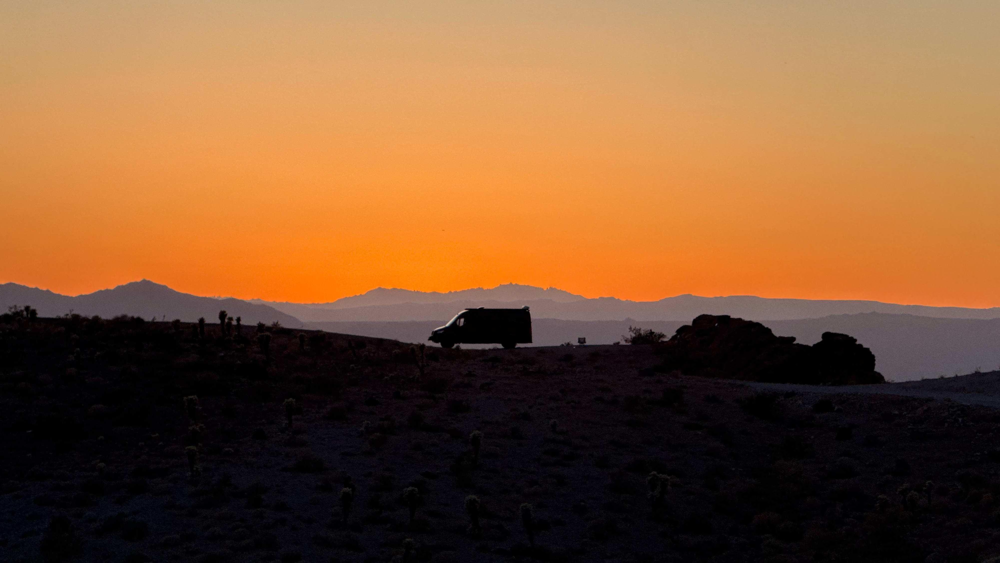

My submission for the [Waterloo Co-op photo contest](https://uwaterloo.ca/co-operative-education/work-abroad/photo-contest)

# Where was the photo taken?
On Route 66, Arizona
# The most valuable skill I’ve developed is…
As an organized person, the most valuable skill I learned is to be able to go with the flow and embrace ambiguity
# One thing I learned about myself is… 
It's possible to go really far when I just take it one day at a time

# I made a positive impact by…

# I found beauty in the photo because… 
It captures the beauty of the van I called home for nearly 2 weeks as I travelled from Waterloo to San Francisco to start my internship
